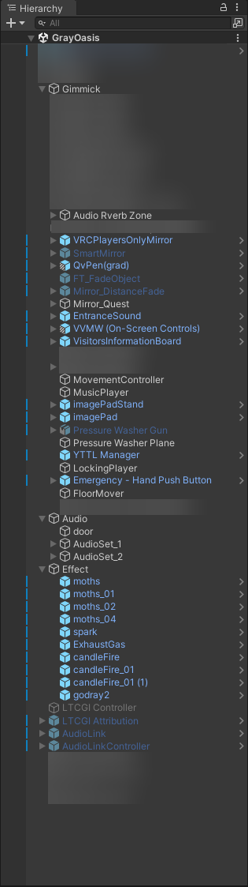

# Config Schema

```jsonc
{
  "disable": { // Lists options that disable objects by default
    "pens": [], // Array of names to default-disable pens ofr
    "video": [], // Array of names to default-disable video player for
    "rain": [], // Array of names to default-disable rain for
    "imagePad": [], // Array of names to default-disable image pads for
    "pathBased" {
      "Gimmick/Audio Reverb Zone": [], // Array of names to default-disable audio reverb zones for
    } // Object of path-name[] to disable
  }
  "spawnAdjustments": { // Lists options that adjust the spawn parametesr
    "stairsTop": [], // Array of names to spawn at the top of the stairs
    "tv": [], // Array of names to spawn in front of the TV
    "bed": [], // Array of names to spawn near the bed
    "chillArea": [], // Array of names to spawn at the chill area (left of the TV)
    "spawnMirror": [] // Array of names to enable a spawn mirror for. It auto-disables when u move away from it
  }
}
```

## List of path-based objects you can toggle



See the example above on how to supply the correct path.
